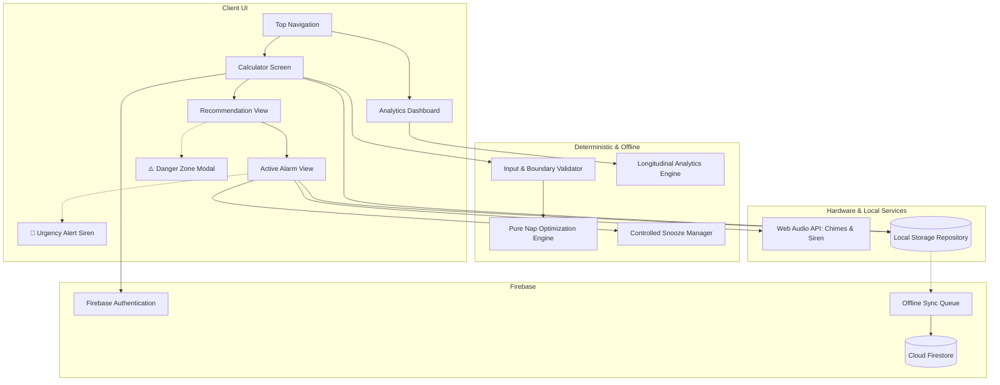

# 💤 Science-Backed Nap Calculator

[](https://github.com/PranviJindal/NAP_CYCLE/actions/workflows/deploy.yml)
[](https://github.com/PranviJindal/NAP_CYCLE)
[](https://opensource.org/licenses/ISC)

> An evidence-based, deterministic decision-support application that calculates optimal daytime nap opportunities, safeguards approaching commitments with controlled snooze and urgency alarms, and tracks longitudinal sleep habits.

🌐 **Live GitHub Pages Deployment**: [https://pranvijindal.github.io/NAP_CYCLE/](https://pranvijindal.github.io/NAP_CYCLE/)

---

## 🔬 Sleep Science Foundations

The optimization engine rejects arbitrary 90-minute sleep cycle assumptions, instead implementing deterministic, peer-reviewed chronobiological principles:

1. **Power Nap (20 min)**: Gold standard for restoring alertness, motor performance, and working memory while staying within light Stage 1/2 NREM sleep, eliminating groggy sleep inertia.
2. **Short Nap (15 min)**: Compact cognitive reset for tight windows ($15 \le \text{Window} < 25$ min) strictly protecting commitment buffers.
3. **Full Cycle Nap (90 min)**: Reserved exclusively for users with significant sleep debt ($< 6.5$h sleep) and ample time windows ($\ge 105$ min) outside the Danger Zone.
4. **Sleep Inertia Mitigation**: Computes grogginess risk (`LOW` vs `MEDIUM`) and reserves a mandatory buffer before obligations.
5. **Danger Zone Protection**: Prevents daytime naps within 6 hours of scheduled bedtime to avoid burning off *adenosine (homeostatic sleep pressure)* and triggering nighttime insomnia.
6. **Circadian Alignment**: Automatically detects the postprandial dip window (1:00 PM – 3:30 PM) where core body temperature naturally drops.

---

## 🏛️ Architecture & System Design



---

## 🎯 Prioritized Feature Delivery

### Priority 1 (P1) — Core MVP
- **Pure Deterministic Nap Engine** (`src/engine/napEngine.js`): Sub-millisecond window allocation and duration selection.
- **Input & Boundary Validator** (`src/engine/validator.js`): Input safety, range validation, and warning generator.
- **Web Audio Alarm Synthesizer** (`src/services/alarmAudio.js`): Offline pentatonic wake chimes (C5, E5, G5, C6).
- **Session Recovery & Local Storage** (`src/services/storage.js`): Preserves active nap timers across tab closes and page reloads.
- **Core Responsive Screens** (`index.html`, `src/styles.css`, `src/app.js`): Quick time presets (`+30m`, `+45m`, `+1h`, `+1.5h`, `+2.5h`), visual timeline, and circular SVG countdown clock.

### Priority 2 (P2) — Commitment Protection & Cloud Sync
- **Controlled Snooze Guardrails** (`src/services/snoozeManager.js`): Strict 2-snooze cap and hard commitment buffer ceiling.
- **Escalating Urgency Alarm**: Alternating 880 Hz / 1320 Hz Web Audio siren and flashing red alert when remaining buffer $< 10$ minutes.
- **Danger Zone Override Modal**: Confirmation intercept for late-afternoon / bedtime-adjacent naps.
- **Firebase Authentication & Firestore Sync** (`src/services/firebaseService.js`): Email/Password, Google Sign-In, and user-isolated Firestore collections (`firestore.rules`).
- **Offline Sync Queue**: Auto-retries cloud sync when internet connection is restored.

### Priority 3 (P3) — Longitudinal Analytics & Dashboard
- **Habit Analytics Engine** (`src/engine/analyticsEngine.js`): Computes Commitment Protection Rate (%), Average Nap Duration, Snooze Frequency Index, and category distributions.
- **Behavioral Habit Insights**: Automated chronobiological recommendations based on historical sleep behavior.
- **Interactive Dashboard & History List**: Real-time metric cards, category breakdown progress bar, and chronological session history.
- **Evaluator Demo Data Loader**: `[🧪 Load Demo Data]` button to instantly populate realistic sessions for inspection.

---

## 🧪 Automated Testing

The project uses Node.js's built-in, zero-dependency test runner. All 20 tests pass with 100% success:

```bash
npm test
```

### Test Suites:
- `tests/napEngine.test.js`: Boundary conditions, duration brackets, sleep debt, Danger Zone, and meal context.
- `tests/snoozeManager.test.js`: Snooze caps, buffer ceiling limits, smart trimming, and urgency state transitions.
- `tests/firebaseService.test.js`: User registration, session isolation, and offline queueing.
- `tests/analyticsEngine.test.js`: Statistical aggregations, protection metrics, and habit insights.
- `tests/e2eWorkflow.test.js`: Full end-to-end user lifecycle integration test.

---

## 💻 Local Development

1. **Clone the repository**:
   ```bash
   git clone https://github.com/PranviJindal/NAP_CYCLE.git
   cd NAP_CYCLE
   ```

2. **Run tests**:
   ```bash
   npm test
   ```

3. **Start local server**:
   ```bash
   npm start
   ```
   Open `http://localhost:3000` in your browser.

---

## 📄 License
This project is licensed under the ISC License.
